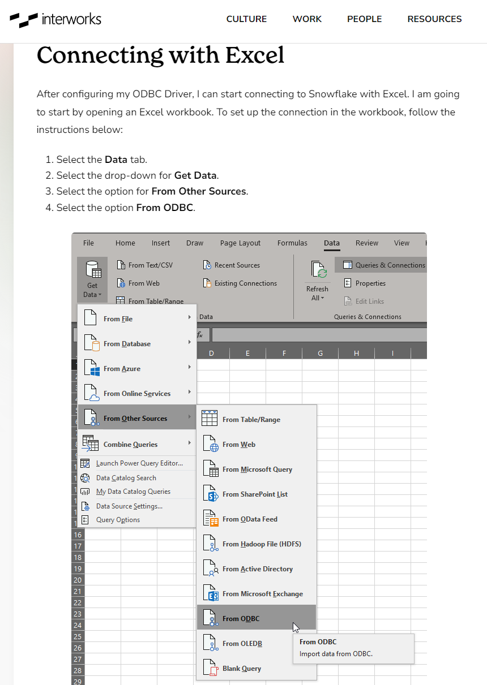
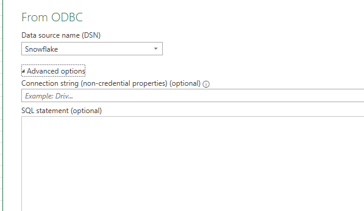

# 🔌 ODBC Connection to Snowflake 

Welcome to the **ODBC Connection** section of our repository!

This section outlines how to create a connection between Snowflake and Power Bi & Excel to pull data directly into your platform of choice

## 📐 What’s Included

In this section, you’ll find:
- How to set up a data source in ODBC Data Source Administrator 
- The process of pulling data into Excel & Power BI
- Tips & Tricks

## 👷‍♂️ ODBC Data Source Administrator

Once the ODBC driver has been installed by IT, you can find it by going to the Start Menu and then typing in ODBC, there is some configuration needed.

If it's not there, try these steps to get the software installed:
    1. Restart the laptop.
    2. If still not there, try these steps:

    
**Create the data source** in the User DSN tab to avoid needing admin rights again, click on **"Add..."** 
and select **"SnowflakeDSIIDriver"** near the bottom of the list.

Then make sure to name the **data source** as **"Snowflake"**, as a team we need to make sure we have the same data source name so we can refresh each other's files without having to go in and change the connection.

Lastly, Change the **Authenticator** to **externalbrowser** and include the details numerically referenced below which can all be found in the account details pop up in Snowsight:

Please note, when using using Single Sign On, you do not need to include a password.

## 📊📈 Importing to Excel or PBI:
### Instructions for Excel:

If you need to enter a specific query instead of selecting a table/view, you can expand on "Advanced options" on this screen to open up a text box for your SQL statement:

(If you need any further details, this guide by Interworks might help:
https://interworks.com/blog/hcalder/2019/01/30/query-snowflake-with-excel/)

You should expect a username/password prompt like this when setting up a ODBC connection in Excel/PBI, as you are expected to supply credentials and approve the MFA prompt to connect to Snowflake. 

Note: if you have Single Sign-On (SSO), click on the 2nd option, Windows, on the left green panel below instead, and then Connect in the bottom right, to connect with the default windows credentials (which will automatically link with the Snowflake credentials as part of SSO, and give you a MFA prompt via your Microsoft Authenticator if it is the first time, and not the Cisco Duo App.)

### Instructions for Power BI:
And then for Power BI, take care not to use the default Snowflake connector, instead search for "ODBC" and select the one with the blue icon as shown below: (the steps are then same as in Excel as shown in the example above)

If you have a SQL statement for your report, you can expand on "Advanced options" to enter it there.

## ☝️🤓 Tips and Tricks
### Power Query Disruption
Please note that once you have swapped your SQL script over to your snowflake one in PBI, you will find any transformations you have done in Power Query will be lost and need to be done again. To help you with this, you can either:
1) Make note of all transformations done ahead of moving the script, so you can follow these easily
2) Take a copy of the PBI report so you can compare the new and old reports to follow what you need to do in Power Query.