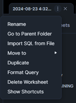

### Query shortcuts
* You can find various shortcuts built into the Snowsight UI (3 dots on the script tab, see below)  

* `Ctrl` + `Enter` - run the script up to the next semi-colon (;)
* `Ctrl` + `Shift` + `Enter` - run the whole script
* `Shift` + `Ctrl` + `H` - Find and replace (doesn’t automatically pick up the word you are highlighting, like SSMS)
* `Ctrl` + `/` - comment the line the cursor is on

> [!TIP]  
>  Highlighting any text and typing double quotations puts "" around the text without deleting the text (as you would normally expect). The same applies to adding single quotes ('), brackets (), square brackets [] and apostrophe (`)

> [!TIP]  
> Alt + mouse drag OR Alt + arrow keys. This allows you to do what is called "multi-line editing" where you can place multiple cursors and type on multiple lines simultaneously. Here's a link to a YouTube short that explains how this feature works (https://www.youtube.com/shorts/bSko0uBdNNE)

### Navigation and User Interface
