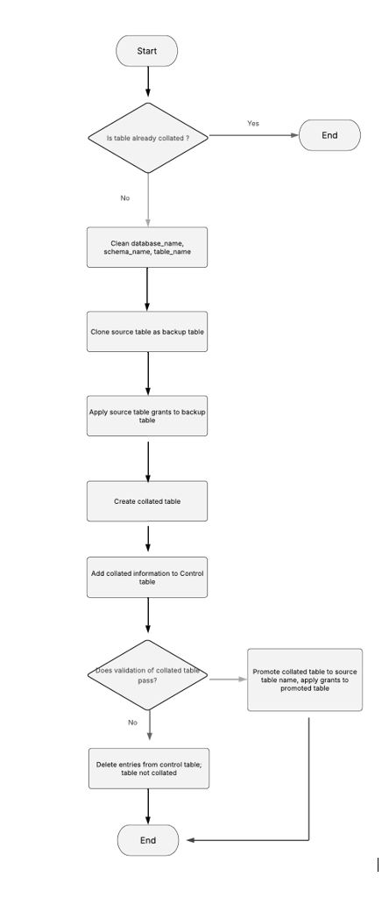

# Snowflake Collation Project

This project provides code to convert case-sensitive `TEXT`/`VARCHAR` columns in Snowflake tables to case-insensitive using the collation `'en-ci'`.

## Overview

The repository includes two Python-based stored procedures for use in Snowflake:

- Collate a **single table** with `TEXT`/`VARCHAR` columns
- Collate **an entire schema** of tables with `TEXT`/`VARCHAR` columns

## How It Works

The stored procedures are written in Python using Snowflake Snowpark. They transform text-based columns to apply the `'en-ci'` collation, making string comparisons case-insensitive.

> **Note**: No Python knowledge is required to execute the procedures.

A high-level process flow is shown in the diagram:  


---

## Prerequisites

- A Snowflake account with **`ACCOUNTADMIN`** role privileges
- Permission to create roles, schemas, warehouses, and stored procedures

---

## Setup Instructions

The `setup.sql` script creates all required Snowflake objects.

### Configuration

Before running `setup.sql`, replace the following placeholders:

- `'databasename'` → your target database
- `'schemaname'` → your schema name  
  _Example: `USE SCHEMA "Test"."Monitoring"`_
- `'SnowflakeUser'` → the user who will execute the collation  
  _**This user must have `ACCOUNTADMIN` access**_

### Execution Steps

1. Log into Snowflake as `ACCOUNTADMIN`
2. Execute the `setup.sql` script in full

---

## Snowflake Objects Created

- **Role**: `COLLATION_ADMIN`
- **Schema**: `CONTROL`
- **Warehouse**: `COLLATION_WH`
- **Stored Procedures**:
  - `CREATE_COLLATION_TABLE` — for single table collation
  - `CREATE_COLLATION_TABLES` — for schema-wide collation
- **Tables**: Control and logging tables in the `CONTROL` schema
- **Grants**: All required privileges granted to the `COLLATION_ADMIN` role

---

## Usage

### Collate a Single Table

```sql
CALL CONTROL.CREATE_COLLATION_TABLE(
    'MY_DATABASE',
    'MY_SCHEMA',
    'MY_TABLE',
    'SOURCE_ROLE',
    'en-ci'
);
```

### Collate a Schema of Tables

```sql
CALL CONTROL.CREATE_COLLATION_TABLES(
    'MY_DATABASE',
    'MY_SCHEMA',
    'SOURCE_ROLE',
    'en-ci'
);
```
### Example

```sql
CALL CONTROL.CREATE_COLLATION_TABLE(
    'Test',
    'Monitoring',
    'THYROID_MONITORING',
    'COLLATION_ADMIN',
    'en-ci'
);
```

will create collated and backup versions of an applicable table:

- Database "Test"
 - Schema "Monitoring"
   - THYROID_MONITORING
   - THYROID_MONITORING_01082025_BACKUP

```sql
CALL CONTROL.CREATE_COLLATION_TABLES(
    'Test',
    'Monitoring',
    'COLLATION_ADMIN',
    'en-ci'
);
```
will create collated and backup versions of every applicable table in the schema

---

### FAQ

#### Do I need Python experience to run the code?
No. The stored procedures are written in Python but can be run by users without Python knowledge

#### Will the collation process overwrite my original table?
No. A backup is created first. The original table is only replaced **after validation**

#### Can I collate all tables in a schema at one ?
Yes. Use the `CREATE_COLLATION_TABLES` stored procedure to process all applicable tables in the schema

#### What if a table has no `TEXT`/`VARCHAR` columns?
Only tables with applicable text columns are processed

#### Will this code process views ?
No. It only operates on tables. However, you can create a view on top of a collated table, and the view will inherit the underlying column collation.

#### Where can I check to see if the table was actually collated?
Refer to the `CONTROL.COLLATION_CONTROL_TABLE`, which tracks all collated tables. It includes the names of collated columns, the applied collation, and the timestamp of the operation. Additionally, a status value of success/not applicable to non-TEXT columns is recorded during collation.

#### What does the CONTROL.COLLATION_LOG_TABLE do ?
After a table is collated, it undergoes validation against the source table. This includes:

- Comparing data integrity for the collated columns
- Verifying column counts match
- Ensuring row counts are identical

The results of these checks are logged in the `CONTROL.COLLATION_LOG_TABLE`. Only if all validations pass is the collated table promoted to replace the original table. The original table is then dropped, and its grants are applied to the promoted table.

#### Do I need to create the stored procedures and control tables in every schema ?
No. You should create a single `CONTROL` schema per database to house the stored procedures, control table, and log table. As long as the `COLLATION_ADMIN` role has the necessary privileges on the target schemas, and the procedures are executed using this role, the collation process will work as expected. If in doubt refer to instructions found in `setup.sql`

#### Is there a rollback process ?
Yes. If the validation fails, the rollback process begins where entries for the collated table are removed and the collated table and backups tables dropped so what's left is the original source table. The `CONTROL.COLLATION_LOG_TABLE` should also be checked to help with troubleshooting which aspect of the validation failed

#### How do I see the grants assigned to the role COLLATION_ADMIN ?
Execute the code `SHOW GRANTS TO ROLE COLLATION_ADMIN`and this will show you all the rights assigned to this role and the objects the rights apply to

## Author

Developed by Angela Ebirim \
Senior Data Engineer, NHS North East London Integrated Care Board \
email: angela.ebirim4@nhs.net \
Date: August 2025

## License

MIT License \
© 2025 Crown copyright \
NHS North East London Integrated Care Board \

This software is released under the Open Government V3 and MIT Licenses. All output subject to Crown Copyright.


