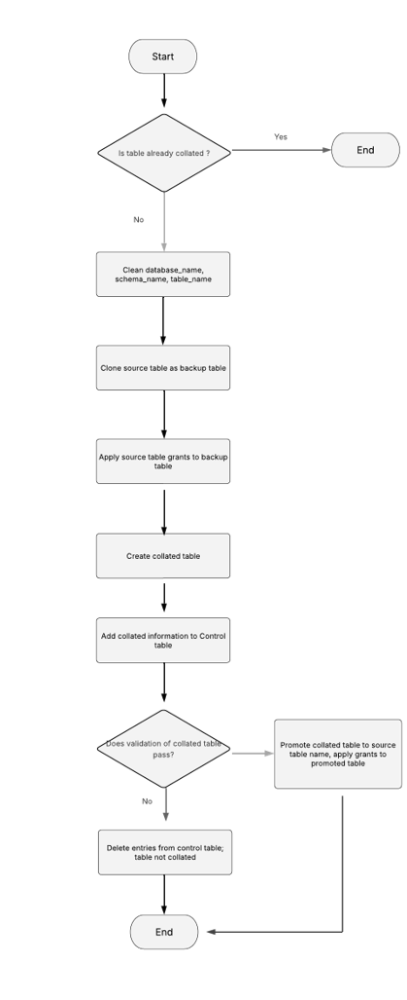

# Snowflake Collation Project

This project provides code to convert case-sensitive `TEXT`/`VARCHAR` columns in Snowflake tables to case-insensitive using the collation `'en-ci'`.

## Overview

The repository includes two Python-based stored procedures for use in Snowflake:

- Collate a **single table** with `TEXT`/`VARCHAR` columns
- Collate **an entire schema** of tables with `TEXT`/`VARCHAR` columns

## How It Works

The stored procedures are written in Python using Snowflake Snowpark. They transform text-based columns to apply the `'en-ci'` collation, making string comparisons case-insensitive.

> **Note**: No Python knowledge is required to execute the procedures.

A high-level process flow is shown in the diagram:  


---

## Prerequisites

- A Snowflake account with **`ACCOUNTADMIN`** role privileges
- Permission to create roles, schemas, warehouses, and stored procedures

---

## Setup Instructions

The `setup.sql` script creates all required Snowflake objects.

### Configuration

Before running `setup.sql`, replace the following placeholders:

- `'databasename'` → your target database
- `'schemaname'` → your schema name  
  _Example: `USE SCHEMA "Test"."Monitoring"`_
- `'SnowflakeUser'` → the user who will execute the collation  
  _**This user must have `ACCOUNTADMIN` access**_

### Execution Steps

1. Log into Snowflake as `ACCOUNTADMIN`
2. Execute the `setup.sql` script in full

---

## Snowflake Objects Created

- **Role**: `COLLATION_ADMIN`
- **Schema**: `CONTROL`
- **Warehouse**: `COLLATION_WH`
- **Stored Procedures**:
  - `CREATE_COLLATION_TABLE` — for single table collation
  - `CREATE_COLLATION_TABLES` — for schema-wide collation
- **Tables**: Control and logging tables in the `CONTROL` schema
- **Grants**: All required privileges granted to the `COLLATION_ADMIN` role

---

## Usage

### Collate a Single Table

```sql
CALL CONTROL.CREATE_COLLATION_TABLE(
    'MY_DATABASE',
    'MY_SCHEMA',
    'MY_TABLE',
    'SOURCE_ROLE',
    'en-ci'
);
```

### Collate a Schema of Tables

```sql
CALL CONTROL.CREATE_COLLATION_TABLES(
    'MY_DATABASE',
    'MY_SCHEMA',
    'SOURCE_ROLE',
    'en-ci'
);
```
### Example

```sql
CALL CONTROL.CREATE_COLLATION_TABLE(
    'Test',
    'Monitoring',
    'THYROID_MONITORING',
    'COLLATION_ADMIN',
    'en-ci'
);
```

will create collated and backup versions of an applicable table:

Creates:

   - THYROID_MONITORING (collated)
   - THYROID_MONITORING_01082025_BACKUP (backup)
  

```sql
CALL CONTROL.CREATE_COLLATION_TABLES(
    'Test',
    'Monitoring',
    'COLLATION_ADMIN',
    'en-ci'
);
```
will create collated and backup versions of every applicable table in the schema

---

### FAQ

#### Do I need Python experience to run the code?
No. The stored procedures are written in Python but can be run by users without Python knowledge

#### Will the collation process overwrite my original table?
No. A backup is created first. The original table is only replaced **after validation**

#### Can I collate all tables in a schema at one ?
Yes. Use the `CREATE_COLLATION_TABLES` stored procedure

#### What if a table has no `TEXT`/`VARCHAR` columns?
Only applicable tables with text columns are processed

#### Will this code process views ?
No. It only operates on tables. However, you can create a view on top of a collated table, and the view will inherit the underlying column collation.

#### Where can I check to see if the table was actually collated?
Query `CONTROL.COLLATION_CONTROL_TABLE` - It records:
- Names of collated columns
- Applied collation
- Timestamp
- Status (`success` / `not applicable`)

#### What does the CONTROL.COLLATION_LOG_TABLE do ?
It logs the results of validation checks after collation:
- Data integrity for collated columns
- Column counts
- Row counts

Only if all checks pass is the collated table promoted to replace the original.

#### Do I need to create the stored procedures and control tables in every schema ?
No, one `CONTROL` schema per database is enough, provided `COLLATION_ADMIN` has privileges on the target schemas

#### Is there a rollback process ?
Yes. If the validation fails:
1. Entries for the collated table are removed
2. Collated and backup tables are dropped
3. The original table remains untouched 

Query `CONTROL.COLLATION_LOG_TABLE` for troubleshooting

#### How do I see the grants assigned to the role COLLATION_ADMIN ?
`SHOW GRANTS TO ROLE COLLATION_ADMIN`

---

### Performance Metrics


| Row count     | COMPUTE_XS | COMPUTE_M | COMPUTE_LG  |
|:-------------:|:----------:|:---------:|:-----------:|
| 1,000         | 12         | 18        | 14          |
| 100,000       | 15         | 17        | 17          |
| 1,000,000     | 19         | 19        | 20          |
| 10,000,000    | 24         | 19        | 25          |
| 100,000,000   | 53         | 29        | 21          |
| 1,000,000,000 | 378        | 114       | 61          |

> **Note**: Performance, measured in seconds, varies based on warehouse load and network factors
---

## Author

Developed by Angela Ebirim \
Senior Data Engineer, NHS North East London Integrated Care Board \
email: angela.ebirim4@nhs.net \
Date: August 2025

## License

MIT License \
© 2025 Crown copyright \
NHS North East London Integrated Care Board \

This software is released under the Open Government V3 and MIT Licenses. All output subject to Crown Copyright.


